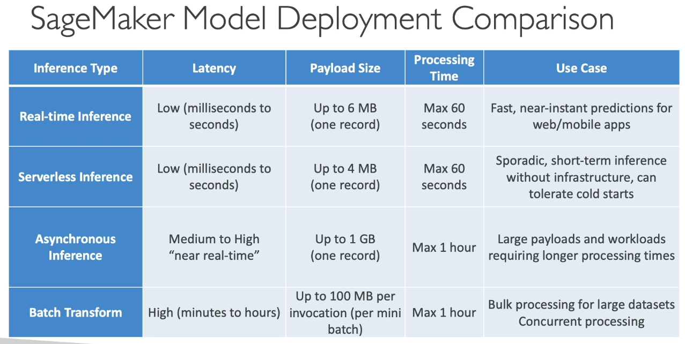
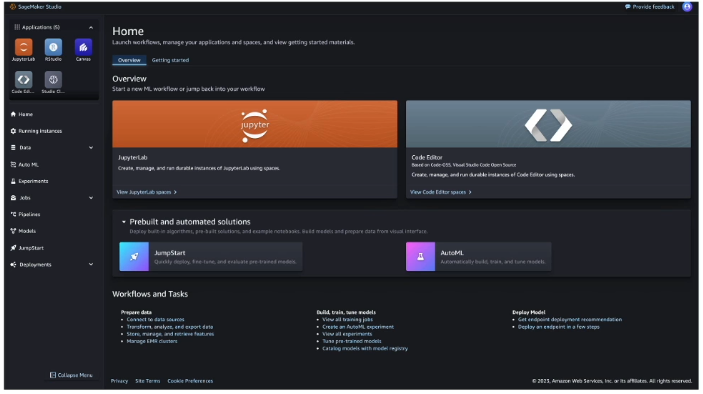
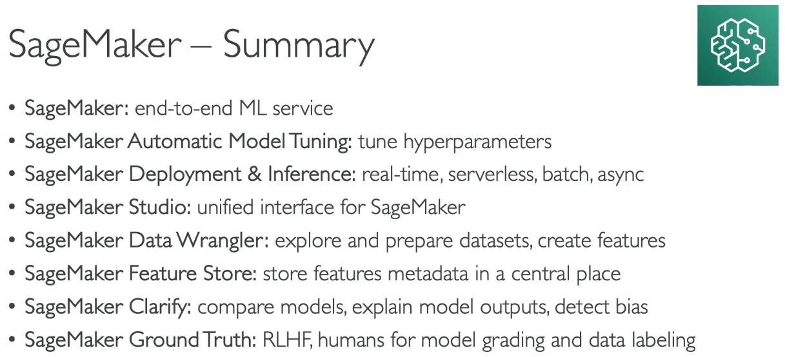
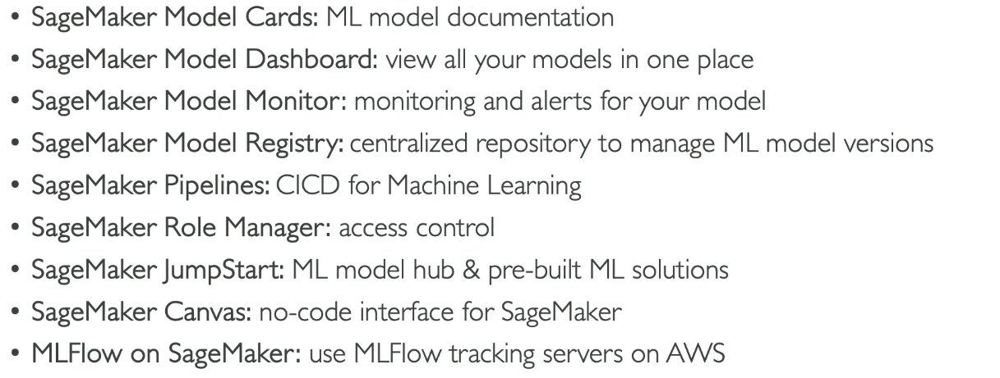

# Amazon SageMaker

- fully managed machine learning service
- To create a model (opposed to Bedrock which only fine-tune an existing model)
- Made for Machine Learning or Model Scientist
- Can do fine-tunning

## Algorithms (extracts)

- Supervised algorithms
--- Linear regressions and classifications
--- KNN algorithms (for classifications)
- Unsupervised algorithms
--- Principal Components Analysis PCA)
--- K-means (for grouping)
--- Anomaly detection
- Textaul algo (NLP)
- Image processing (image recognition...)

## Automatic model tunning

Can tune your model, help choose the hyperparameters, can runtime a tuning job with early stop condition if possible

## Model deployment and inference

One clic deployment of model for inference (request handling)

- it can be real time (only one request)
- it's serverless (idle periode between traffic peak -> less costly)
- it can be asynchronous --> passing through source and destination by S3 with long time processing
- it can work on events and using batch transformation (take batches to work)

Important to know this following table for the certification :



## SageMaker Studio

- Unified development interface for ML
- Team collaboration
- Tunning and debug
- Workflow



Note JupyterLab --> Web based IDE for SageMaker.

## SageMaker Data tools

### Data Wrangler

- Prepare data by cleansing, explore, visualize (graphs, since it can have big impact), preview, and process data.
- SQL support.
- Data transformation.
- Can export the dataflow to another service (for example a machine learning model)

### Feature Engineering

**Feature engineering :** Adapt, add and transform data if needed --> imagine an excel of birthday, you'll add a column in the excel to have a column of ages.
**Feature store :** can help you find the best way to transform data into something "better" for a later usage. Can get directly informations from the data wrangler. 

## SageMaker Clarify

- Evaluate the foundation model (is this model performant for my needs ?)
- Compare model between them on pertinence
- Can explain how a model works and makes predictions
- Understand models characteristics
- Debug predictions provided by the model after it's deployed
- Helps increase the trust in the model

Example of questions it can answer : 
```
hey why this model predicted a loan rejection in the next 6 months ?
hey why thie model sent back a wrong prediction ?
```

Explain biases and problems in dataset.

## Sagemaker Ground Truth

RLHF = Reinforcement Learning from Human Feedback

Humans can work on results given by the model and proceed to add specific sources "good answer, bad answer...", add labels, annotations, evaluation from your team etc...
Typically those reviewers can be what we saw in last section
- mechanical turk (people working with Amazon and doing reviews all day long)
- private (colleagues, your business team)
- marketplace (a company specialized into doing this job)

## SageMaker ML Governance

Every model has a *model card*: basically informations like name, creation date, model status (draft...), version number, known risks and limitations, bias etc...
SageMaker has a dashboard *SageMaker Model Dashboard*, a central repository specialized to list all models with their model cards.


## SageMaker Pipeline

**very nice for devops**

A workflow that automates the process of building, training, and deploying a ML.
Pipelines are composed of steps , each doing a specific task

- processing : raw data to clean data
- training : training a model
- tunning : hyperparametering a model
- AutoML : automatically train a model
- Model : create or register a new model
- ClarifyCheck : perform checks against baseline (data bias, model bias, model explainability)
- QualityCheck : data quality, model quality
- .....

## SageMaker Jumpstart

A public hub of most known models, linked with SageMaker

## SageMaker Canvas

A way to build a model only using a visual interface.
Thos models can be used with bedrock and sagemaker.

Canvas also has ready to use models, very nice to build stuff based on models behind "rekognition", "transcribe", "comprehend" ...

## SageMaker MLFlow

- An interface able to help you manage the full lifecycles of ML.
- Can track runs and experiments.
- Part of SageMaker Studio

## SUMMARY





## Extra features

- Network isolation mode : SageMaker can run without passing through the web
- SageMaker DeepAR forecasting algorithm : used to forecast time-series data using reccurent neural network (RNN)


## Quiz

SageMaker = create a new model + fine tunning + whole lifecycle
Bedrock = fine tunning only
Amazon Q developer = develop apps using models

Amazon SageMaker Clarify helps you having many infos about models including vizualize bias and understand the model behaviour

A Model card of a model explains its risks of usage (beyond other things like name, version, creation date ...)

Nocode-solution for doing a model =>  SageMaker Canvas !

Jumpstart can help you with starting working on an existing model, it's an open hub and can propose you many products.
Bedrock is only for fine-tunning and is not related to the usage.

Analyse a video to predict something as the video is playing --> real time prediction 
