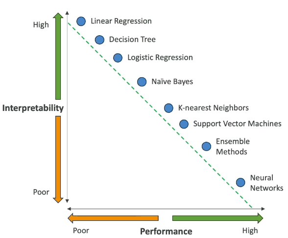
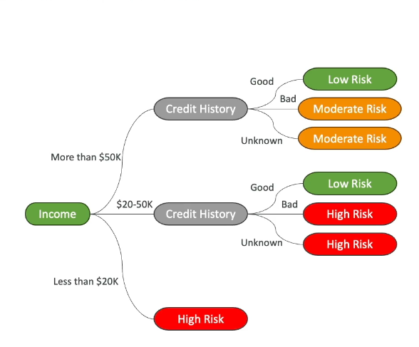
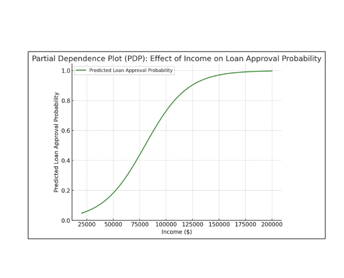
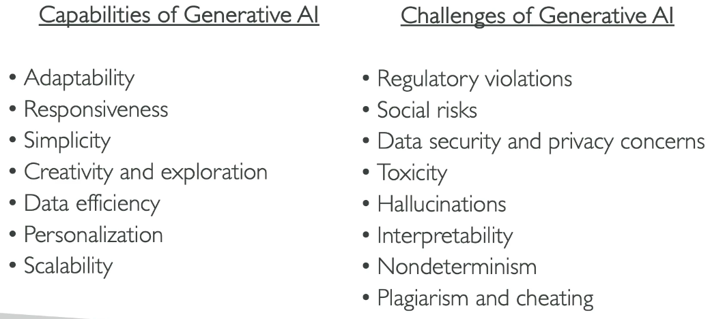
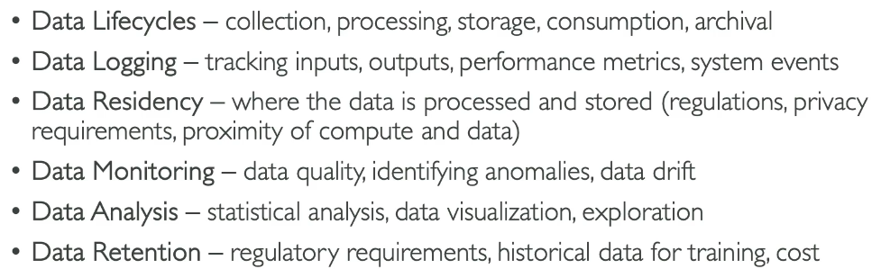
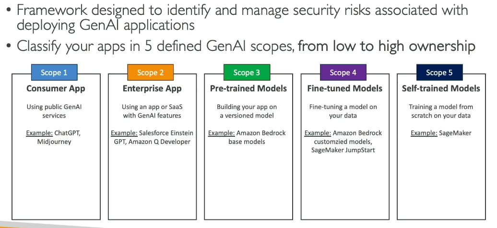
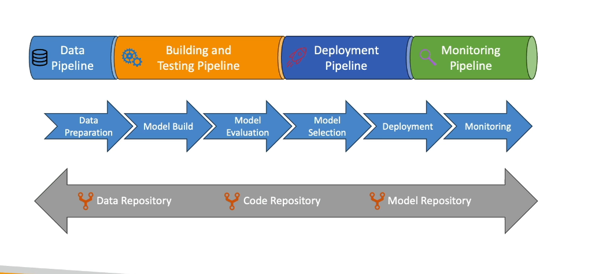

# Challenges and responsabilities

## Responsible AI

Make sur AI is transparent and trustworthy
mitigation security and non pertinent (violent) answers
**Governance :** make the AI legal --> important when treating healthcare, drugs etc...

- fairness : prevent discrimination
- explanability
- privacy : control over personal data
- transparency
- veracity and robustness : reliable answers
- governance : make this AI legal (enforce responsability over AI)
- safety : safe and beneficial for individuals and society
- controlability : align to human values

## To make it safer

- Bedrock since it's made to fine tune a mode
- guardrail
- sagemaker clarify -> bias detection and FM evaluation
- sagemaker data wrangler -> fix bias by balancing datasets
- sagemaker model monitor -> quality analysis of the model
- Amazon Augmenter AI (A2I) -> to get a human review
- governance -> SageMaker role manager,model cards, model dashboard...

AWS has some service cards explaining their responsability for each service

Interpretability -> the degree to which a human can understand the cause of a descision.
Explainability -> understand how the model is working

## High interpretation and decision tree

Supervised learning algorithm -> used for classification -> **mathematical regression**
---> split data into branches based on feature values
---> splitting can be simple "is the value higher than..."
---> caution on overfitting if too many branches

Reminder : **Regression** -> get X next values. 

**Partial Dependance Plot (PDP)** --> show how a feature can influence a result

Reminder : A feature is an individual measurable property or characteristic of a data set.
Examples:
- in image recognition, a color could be a feature
- in a recommandation algorithm (like the one from netflix) a feature could be the types of shows you've watched

--> great for explainability or predictability

**Human centered design (HCD)** for explanable AI
- amplified descision making
- unbiased decision-making
- design for human and ai learning, with cognitif apprentship

## About GenAI

To avoid hallucinations : wrong answers by deductions based on what the model know, deductions which are wrong by missing data 
---> Educate the model
---> keep datasets clean
---> do some prompt engineering to engage the model of telling you "I don't know" when he doesn't know.

## Compliances

Mandatory rules to follow to be sure the job is done properly
- Audit
- archival special...

AI must be able to work in such environnement
- complexity
- risks
- biases
- dynamism
- legality
- regulation
- ...

Model cards should expose all thoses elements to be sure it's compliant with the needs.

- Responsible AI
- Governance Structure and Roles
- Data Sharing and Collaboration

## Data Management Concepts

## Data Lineage

- Know sources citations
- Document data origins
- Cataloging (organization and documentation of datasets)

All that helpful for transparency, traceability and accountability.

 
## About Security

- Threat Detection --> you can train the model to detect fake content, manipulated data, automated attacks...
- Vulnerability Management
- Infrastructure Protection

Prompting can be a good way to try to get some unauthorized content. That is the reason why we need a secured model to do those detections.

Of course things like IAM controls and Multi factor authentications are great.

## Monitoring AI systems

Performance :
- Model Accuracy : ratio of positive predictions
- Precision : Ratio of true positive predictions
- Recall : Ratio of true /positive predictions / Ratio of Total Positive Prediction 
- FI-Score : Average of Precision and Recall
- Latency : Time taken by the model to make a prediction

Infrastructure monitoring :
- Bottlenecks and failures

## GenAI Security Scoping Matrix

Security Generative AI
- Governance & Compliance
- Legal & Privacy
- Risk management
- Controls
- Resilience

# MLOps

Equivalent of DevOps but dedicated to model management
- create from scratch
- fine-tune
- versionize
- deploy
- monitor
- test and evaluate

- data repository example : AWS S3, GCP cloud storage (s3)...
- code repository example : git
- model repository example : AWS S3, GCP cloud storage (s3)...

# Quiz

GenAI is NOT capable of determinism

**Responsible AI** = Mitigating potential risks and negative outcomes that can emanate from an AI system.
Responsible AI is NOT related to scalability
Responsible AI is about :
- data security
- toxicity and how to avoid it and be relevant
- hallucinations

**Governance** helps with processes that define, implement and enforce compliance. Being Compliant (for example being legal) is the fact to apply a governance on a mode.

**Explainability** permit to compensate the biases by understanding the limitations. 

**AWS AI Service Cards** will give you more informations about what part of responsible AI AWS has implemented in their AI services 

**Interpretability** A model that provides transparency into a system so a human can explain the model's output

**HCD** Human Centered Design = It's just the way to remember that a AI can be used to make decisions but should not be used blindly by people. 
---> "Amplified decision-making"

**Exposure** : what data a GenAI should (or should not) expose --> example personal data

**Biais** Concept par lequel un modele ne disposant pas de toute la culture de l'univers va permettre d'obtenir une réponse et en quoi cette réponse est en décalage avec la réponse optimale que l'on devrait obtenir.
--> Le concept d'explainability va permettre d'infléchir voire d'annuler le biais de la réponse pour obtenir une réponse plus adaptée. Pour cela il faut pouvoir connaitre les biais de connaissance du modèle -> Explanability
--> A ne pas confondre avec l'interpretability qui va permettre de corriger la réponse donnée par le modèle --> à rapprocher de la transparency qui permet d'expliquer le modèle.

