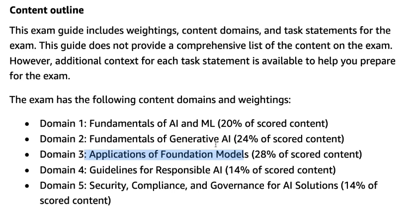

# Exam preparation

https://aws.amazon.com/certification/certified-ai-practitioner/

Required 70% just to pass.

See the associated pdf in this directory to see the complete exam guide.

https://d1.awsstatic.com/training-and-certification/docs-ai-practitioner/AWS-Certified-AI-Practitioner_Exam-Guide.pdf

(free) AWS Skillbuilder Standard Exam Prep Plan: AWS Certified AI Practitioner (AIF-C01) (13 courses, 18h):
https://explore.skillbuilder.aws/learn/public/learning_plan/view/2193/plan

Official Practice Question Set:
https://explore.skillbuilder.aws/learn/course/internal/view/elearning/19790/exam-prep-official-practice-question-set-aws-certified-ai-practitioner-aif-c01-english

## Questions by AWS Certificate example

https://awscertificationpractice.benchprep.com/app/aws-certified-ai-practitioner-official-practice-question-set-aif-c01

Bedrock -> to create images and do not want to host a platform.
External source of knowledge+least development effort -> RAG
Foundation mode -> a large general-purpose model that is pretrained on diverse dataset and made to be fine-tuned.
Control the access to Bedrock -> IAM
Register the calls on Bedrock API -> Cloudtrail
Fine-tune tradeoffs -> higher cost + higher complexity
Control vulnerabilities of ECR and EC2 over AWS -> Amazon Inspector
AI limitation for description of site -> beware of biaised of inappropriate content
Detect text from image -> Textract
**Custom language domain** transcription accuracy -> custom language model in Amazon Transcribe

Valid data for instruction-based fine-tuning
---> Prompt-response text pairs
---> their was a proposition for "image with label" BUT it's an instruction based fine-tunning so -> text based.

 
High accuracy on training data + Low accuracy on real data -> Overfitting.

Record risks model and training information of the model -> Sagemaker Model Cards

A company want to assess the performance of a foundation model FM for text genetaion. Which technique -> ROUGE

Do a contract is valid with compliance rules ? --> Use JumpStart for text summurization and audit cases.

In short: 
**Amazon Q Business is about automating business processes with AI**
**JumpStart is about getting ML models running quickly on AWS.**

Help a model to create descriptions for users
===> Few Shot examples with correct examples as models.

https://udemy.com/course/aws-ai-practitioner-certified/learn/quiz/6463763#overview

