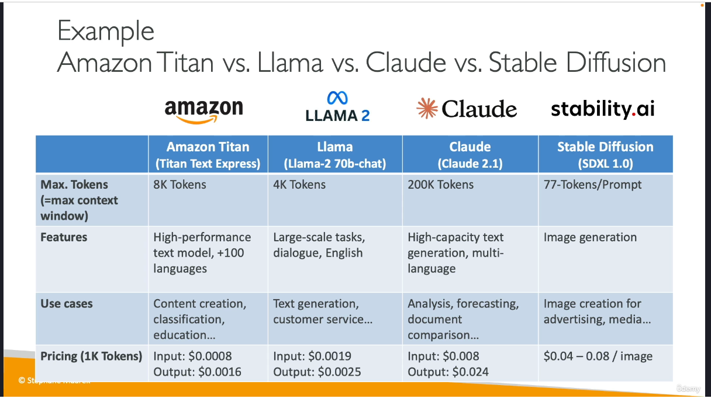

# Section 6 - GenAI + Bedrock

## What is genAI

GenAI:
 - Subset of Deep Learning
 - Use to generate new data similar to what it has been trained with

Pretrain -> brain -> adapt -> then able to generate new data

Fundation model : to generate data we must rely on Fundation model (ex. GPT-4o being the fundation model behind ChatGPT

LLM : Type of AI designed to generate coherente human-like text
GPT-4 is a form of fundation model AND a LLM

Generative Language Models : LLM /Generative LLM are non deterministic, meaning that every result can be different relying on probabilities

Input : `After the rain, the streets were`
Output possible :
- flooded
- wet
- ...

and then continuing with a coherent probabilities result 

Input + step+1 : After the rain, the streets where wet`
Possible next word:
- and
- or
- so
- .

then a result is chosen.

multi-modal prompt AI work the same way using possible an image or a text as input.

## Amazon Bedrock

Bedrock is about manipulating and fine-tunning a preexisting model.

Meant to build a generative AI application on AWS.
Fully Managed, no server.
Pay per use pricing model
Unified API
Leverage a wide array of foundation models
RAG, LLM Agents...
Bedrock makes a copy dedicated for you to play with.

### How to chose

- model type
- performance
- capabilities
- constraints
- compliance
**
- level of customization
- model size
- inference
- licence
- context
- windows
**
- multimodal

Amazon Titan = example of foundation model multi-modal

Smaller means cheaper

Amazon bedrock is able to make you have a prompt, then several models and get the best answer from several model

You can fine-tune a model through Bedrock
-> custom model -> choose the default model (which will be copied in your account) -> add a fine-tuning model mode -> add a job configuration name -> add a bunch of S3 buckets containing datasets on a defined format  -> add hyperparameters (epochs, batch size... a little too big for this level of exam) -> then ouput output S3
--> It is expensive.

## Fine tunning a model

- Instruction based : basically prompts + defined completion(aka answers aka responses) usually on json format that the model will learn, millions of them if possible
- Continued pre-training : aka domain-adaptation fine-tunning to get a specialized model, here still in json, inputs are A LOT of informations, full of explanations and knowledge
- Single-turn message: a message composed of prompt

- Multi-turn message: a whole discussion, or several, just like a chatbot

 

All those are included into the concept of "Transfer learning".

## Automatic evalidation of a model

Basically doing a score on the answer.

You will basically this mechanism

User Input -> Model to evaluate -> model ouput -> Model to calculate the score -> Grading score
So you might need to create a first evaluation model to evaluate the result of a evaluated model
This evaluation model will basically say "hey is this result a good result ?"

Example of evaluation model = BERTScore for BERT

## Automated metrics

Basically by automation, by humans, by AWS teams.

### maths

- Rouge-N
- BLEU
- BERTScore : semantic similary between generated texts

ROUGE score will work as input for BLEU score

### Business metrics

- user staisfaction
- average
- cross domaine
- convertion rate
- ...

## RAG 

Retrieval-Augmented Generation.

A good way to be able to provide always updated data to your foundation model without retraining it.

Allow a foundation model to reference a data source outside of its training data

Yu can imagine storing your whole company business data as a storage that will be retrieved and exploited by the model.

**example :** a vector database, that the model with retrieve some useful data to generate a response.

About vector databases, we will basically consider the data contained in the vector using a specific word = embeddings
So an embeddings model means 
- a model that will have the task to search and retrieve the useful vectors in the database. 
- a model that will have the task to chunk the clean documents into chunks (pieces of texts) then store them in the vector databases.

Note : Example of vector databases
- Opensearch service
- Amazon DocumentDB + nosql
- Amazon Aurora
- RDS for postgresql (+PGvector extension)
- Amazon Neptune (graph database)

Bedrock can act as RAG, and accept local files or files on S3 as inner data to answer to questions sent as prompt.

## More GenAI concepts

- tokenization converting a raw text into a sequence of tokens (words or subwords)

`hello world, it's sunny here`
--->
`hello|world|,|it|'|s|sunny|here`

- context window : Number of tokens an LLM can consider when generating text
the larger context window the best answer
the larger context = more time and cost of getting an answer
- embeddings : basically a token associated with its probabibily to be bound to other model -> vector

Similar semantic == similar vector values.

dog, and puppy have big similar embedding
dog and cat have a similar but less similar since they are still two animals
dog and house have a very different embedding since they both have a very low relationship bound

## Amazon Bedrock Guardrails

Guardrails are some kind of rules of control and filtering of topics.
You can have multiple guardrails

- Control the interaction between models
- Filter harmful and undesirable content
- Remove personally identifiable information ( PII )
- Enhance privacy
- Reduce hallucination

Can lead to the model refusing to answer to certain topics, but will avoid many problems of wrong answers.

Guardrails do not cost money

## Amazon bedrock agents

Make the model being able to interact with external tools and data, can be specialized, we can image an agent able to send API requests and treat the result to assimilate data as input (for example a list of API requests to know the current state of your whole business storage)
Agents can be "hey interconnect will Teams and if a message is sent to "bidule@myteams" contact, get the message.

Agents can be both to get input or to produce outputs --> send a date.

## Monitoring for Bedrock

Using Cloudwatch, or S3 stored log files 

## Pricing

- On demand = pay as you go, no commitment, charged for every input token for text model or charged per generated image for image model
- Batch = multiple prediction at a time, output a single file or files on S3, and can have a 50% discount
- Provisionned Throughput = 
--- Purchase model for a certain time (1 to 6 month)
--- Throughput = max of input/output tokens processed per minute
--- Can work with base model
--- Mandatory for fine tunning a model or work with custom model

Costs : 
- Prompt engineering............= + (better way to express the request)
- RAG...........................= ++ (additional source)
- Fine tunning..................= +++ (strong computation)
- Model adptation fine-tunning..= ++++ (intense computation)

- On demand = Great for unpredictable workload with no long term commitment
- Batch = can have a discount up to 50%
- Provisionned throughput = expected to be expensive, great to "reserve" capacity

- Temperature, top K , top P = no impact on pricing

- Model size = smaller is cheaper

- Number of input/output token = smaller is cheaper, great way to reduce the price

## Quizz

Ultimately human review will always be the best option to be sure the ouputs are adapted to your users.
Bedrock DO NOT train models from scratch, it's always meant to work with an initial foundation model.
Bedrock is perfect for chatbot and dialoging with models
Fine-tunning is about training a pretrained model on a specific new data

