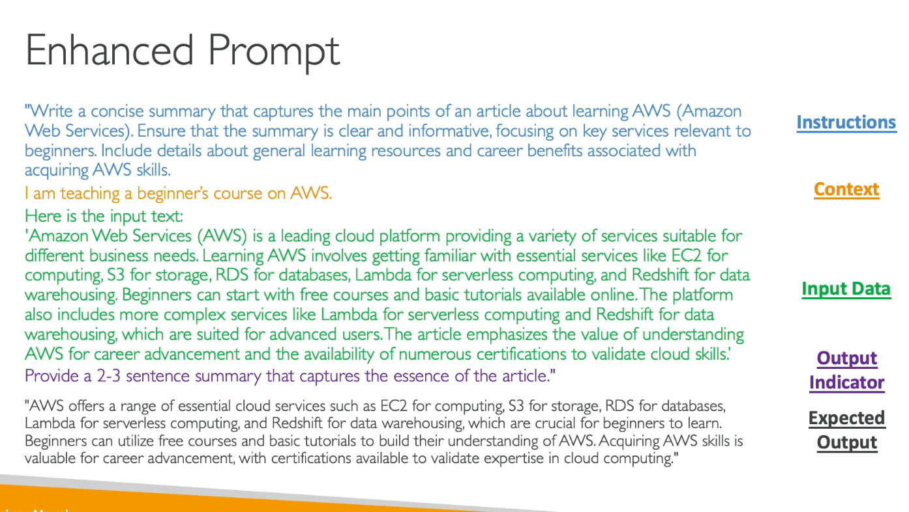

# Prompt engineering

Basic prompting = question, or sentence simple

Improved prompting technique:
- instruction (how to do what I want)
- context (external informations)
- input data (the query)
- output indicated (what I want to get as user)

All of them are including into the prompting



Negative prompting
A technique where you explain what you do not want:
- avoid unwanted content
- maintain focus on a specific subject
- enhance clarity

It's basically telling "I don't want blablabla" in the prompt.

# Prompt performance optimization

Three metrics aside of the prompt :

Temperature ( value between 0 to 1 ) : creativity of the answer, 0 is the least creative, 1 is much more creative and probably less coherent
Top P ( value 0 to 1 ) : will consider the X% most likely words, low value (0.25) will make a more coherent response, high value will make a more creative and diverse output. 
Top K : limit the number of probable words, low value will make more coherent and less creative, high value will make it more creative

A way to improve the performances : 

- System prompt : will give more information on how to behave and answer "reply as if you were a teacher of an IT cloud certification"
- Temperature
- Top P
- Top K
- "Stop sequences" token : a way to tell to signal the model to stop generating new stuff

Prompt latency :
- how fast the model respond
- impacted by model size
- model type itself (Llama if different than Claude for example)
- number of token in input (the bigger the slower)
- number of token in ouput (the bigger the slower)

Latency IS NOT impacted by temperature, top K and top P


# Prompt engineering techniques

- zero shoot prompting = a query -> gives an answer
- few shots prompting = we incorporate a few examples of answers in the prompt with the query we wan to send to the model , can be a discussion too
- Chain of though = we explain how the problem should be taken to be solved properly

We can improve the answer with a RAG (external source of data associated to the model)

# Prompt templates

Aim to simplify and standardize the process of generating prompts.
Basically it's everything you need to make your prompts coherent through a whole discussion, it could be a python string variable, or a go template, or a jinja2 template...

```
{text}

{question}

{choice1}
{choice2}
{choice3}
```

# Quizz

Negative prompting -> made to avoid incorrect or undesirable outputs (to disregard a context you modify the context in the prompt)
Complex project impliying a specific way for logical steps --> Adopt Chain of Though prompting technic
A task has been performed successfully on the past and you want the model to do it again with different input --> Adopt few-shot prompting technique


