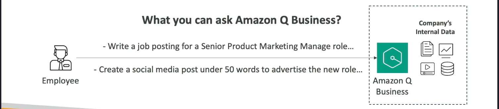
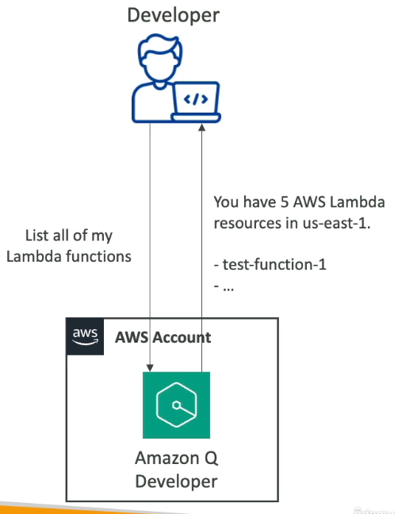
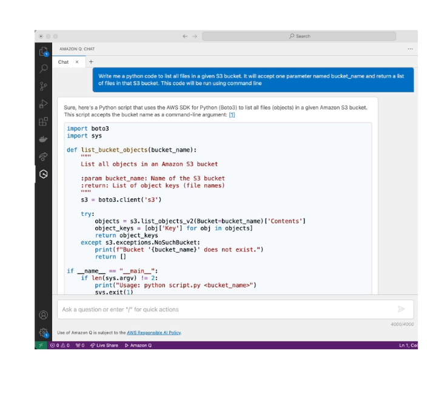

# Amazon Q

## Amazon Q Business

Gen-AI fully based on company's data for your employees 



- Answer questions
- Perform routines
- Generate content
- Automate tasks
- "hey what can you tell me about the meeting from last monday ?"

It's built on Bedrock except that we do not manage the underlying foundation model.

The idea is :
- You have Amazon Q business
- You will interconnect Amazon Q with sources through "data connectors" as datasources (S3, RDS, Aurora, Azure365, Sharepoint, Slack...)
- You can add a third party connector (Jira, ServiceNow...)
- You can add your home made connector (based on API...)

Amazon Q Business can be coupled with IAM to manage users able to manipule it.

IAM identity center can be linked with Active Directory, Google identity...

You can add some guardrails, just like bedrock to avoid some forbidden contents

## Amazon Q Apps

Amazon Q Apps is a part of Amazon Q Business supposed to be able to create apps with only prompting

## Amazon Q developer

Made to question about AWS documentation and AWS service selection, or suggest cli, or have informations about the current account like number of lambda or bills...
You can get the expected commands for AWS commande line with correct options for example.



Allow you to develop your own application using AI in java, javascript, python etc....



Can be integrated with most IDE (Visual studio code, Jet brains...)

## Amazon Q for Quicksight

Amazon Quicksight, is made for creating dashboard of data, it's not related to Amazon Q.

Amazon Q is able to understand natural language.

Amazon Q for Quicksight is able to create dashboard based on your data, on AWS.

## Amazon Q for Glue

Amazon Glue is an ETL able to parse various raw documents to accumulate informations.
For now it will NOT make it able to parse and request informations about raw data, but will make it easier to fix problems about Glue

## Partyrock

Not a real service, it's a playground powered by Bedrock and is accessible without an AWS account.
```
https://partyrock.aws/
```
Allow to experiment about creating GenAI apps using various foundation models (no coding AWS account needed)

IU is similar to Amazon Q Apps.

## Quizz

Amazon Q Business can integrate your company data.
Amazon Q Business is NOT a storage for your company data, even so it can be connected to various software and storage and can be seen as a RAG.
Amazon Q Developer is an AI coding assistant.


