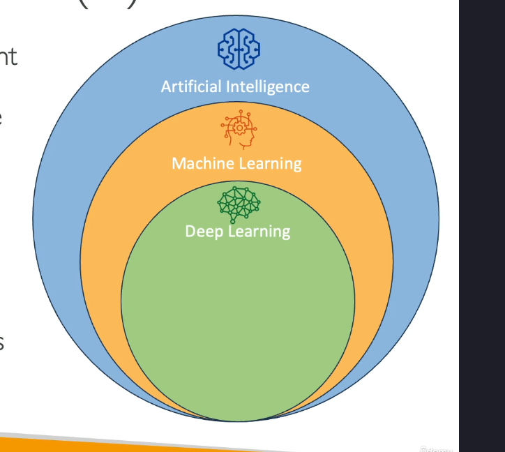
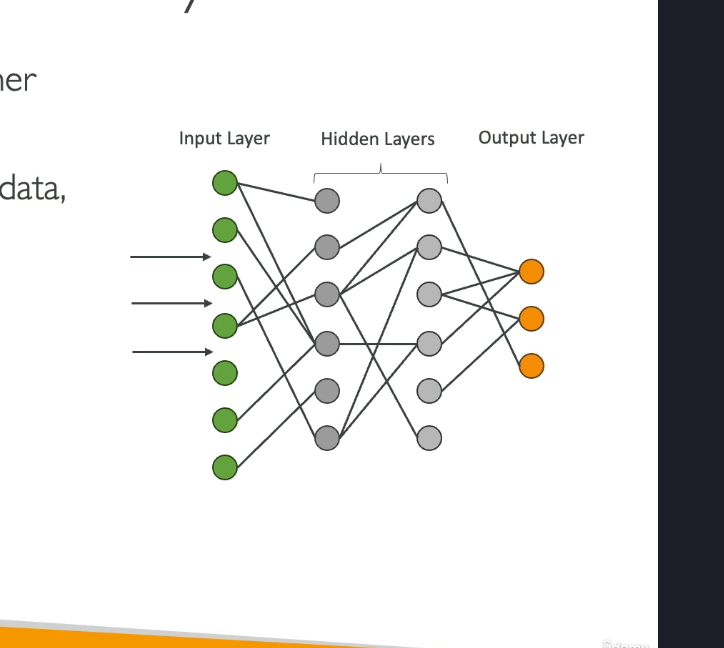
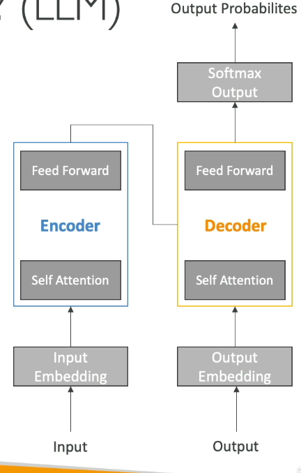
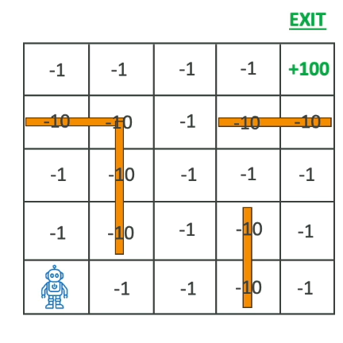
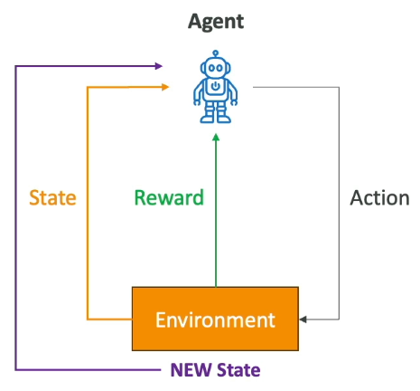

# AI and machine learning

## AI is..

 - Peception
 - Reasoning
 - Learning
 - Problem solving
 - Decision making

 

AI components :
- Data layer (vast amount of data)
- ML Framework (scientists working on how to make a model)
- Model Layer (creation of the model)
- Application Layer (dedication to a certain field)

## Machine Learning

Making predictions, trends (regression and classification) on statistics
Understanding patterns in data

## AI != Machine Learning

Even if both are related, we'll see it later
ML is more about algorithm with predictions, when AI will be able to create new stuff "from scratch".

## Deep learning

subset of Machine learning, to process complex patterns in the data than traditional machine learning, 

 - input layers
 - many hidden layers
 - output layers

Basically deep learning made AI and creating of models possible.

Neural networks = representation of data under a form of network with units (named "nodes") bound together to form layers.

 

## GenAI

subset of deeplearning where a model will play a role as neural network, receive input and produce output.

## LLM (transformer model)

subset of GenAI when you can process a whole sentence instead of word by word.

Can understand natural language.

Example : Google BERT, OpenAI GPT ...

## Multi-modal

Model able to manipulate various input, text, images etc...

## Machine learning (ML) terms

- GPT : generative pretrained transformer -> generate text or code based on user input
- BERT : similar to GPT but read the input in two directions
- RNN : recurrent neural network -> for sequential data like time series or text, useful for image recognition
- ResNet : Deep Convutional Neural Network (CNN) used for image recognition
- SVM : Suport Vector Machine -> ML agorithm for classification and regression
- Wavenet : model to generate raw audio waveform
- GAN : Generative adversial network -> model used to generate synthetic data such as images, videos, sounds similar to trained data, helful for data augmentation

## Training data

Data MUST be clean to train a model

Labeled data = data with both values and associated labels to help the model to understand what it sees
Unlabeled data = data only and the model has to understand what it is talking about -> a little more complicated to understand by the model
Structured data = when your data is a database, Excel ....
Time series data = when your data are things like time scaled curves
Unstructured data = a bunch of maaany things, a little harder to understand

## Machine learning algorithm - Supervised learning

Learn a mapping function that can predict the output
Needs labeled data
Can make mathematical preductions.
Great for classification, perfect to make decision, classment, detection...
 
## Training vs validation vs Test set

Three step for make a model OK
- Training   80% time
- Validation 10% time
- Tests      10% time

## Feature engineering

use a model to make a transformation of data to make to more performant , or improve data using model, and creating variables to do it.

Example :
`All your humans in you database has a birthday, lets add a column for the age.`
`Your image is a castle with a knight, let's extract the knight`

## Unsupervised learning

Can detect complex patterns in data

We usually work with several techniques

- clustering techniques = let's make groups of elements bound together ==> baby -> pacifier & baby -> milk
- association technique = more like transitive ==> bread = water+weat+flour
- anomaly detection technique = detect frauds

## Semi-supervised learning

- use a small part of labeled data
- use a big part of non labeled data

Once the model has learnt labeled data, show it many non labeled data and let the model understand what he sees.

## Self supervised learning

- lot of data
- no clue on how to understand them
- let the model make all the job
- fully rely on the capacity of the model to understand

## Reinforcement learning

A type of machine learning when the model is exposed to a problem where it has to make a descision 

Example : movements of a robot in a maze allowing the agent.

 - agent : the both
 - the environnement : the external system the agent interact with (the maze)
 - action : the movement chosen by the robot
 - reward : what the robot win or loose by doing the movement

The robot will navigate in the maze and make a descision on each loop, trying to minimize the lost points.

Games like Chess, checkers or go, but robotics, finance and healthcare and autonomous cars are usual usage of such concept.

## Reinforcement learning with human feedback (RLHF)

Reinforcement learning but a human tells "here this result is great !".

## Model Fit

When the model has poor performances (time OR the quality of results)

- overfitting : perform well on training data but bad on real data
- underfitting : perform bad on training data, usually a problem of not enough dataset
- balanced : correct

## Bias or variance

- Bias : difference between predicted and actual value
---> usually is due to a bad choice of ML
---> considered as underfitting
 solution : chose a better trained model

Variance : if we change the dataset, does it has a better performance ?
----> high variance = model high sensitive to changing dataset
solution : choose one or several models to cut the difficulty in several prompts

High Bias + Small Variance -> underfit
Small Bias + High Variance -> overfit

## Metrics

- Binary classification (spam or not spam ??)
- Confusion matrix --> get precision of results
- Recall  : when false negative are costly
- F1 Score : best when you balance between precision and recall
- Accuracy : when dataset are balanced

## Inferencing

Inferencing : When a model is making prediction about new data
Perfect example :
 - chatbot (real time inferencing)
 - Night prediction with several tasks (batch inferencing)

Inferencing on the edge : edge device will have a small dedicated language (SLM)

SLM (on edge device) : 
- very slow latency
- low compute
- offline capacity, local inference

LLM :
- on remote server
- more powerfull
- more latency

## Phases of machine learning project

1. Business problem
2. ML problem framing
3. Data collection and preparation --> Clean and we know what we give to the futur model
4. Feature engineering        --> Transform data and create variables for the model
5. Model training and tunning
6. Model evaluation
---> If it's bad -> jump on step 3 or 4
---> If it's good -> continue
7. Model testing and deployment  --> Make predictions
8. Model monitoring and debugging
---> If it's bad -> jump on step 3 or 4
---> If it's good -> Perfect !

You will usually do loops many times, and it's correct !

Budget, a clear goal to achieve and PKI are important before starting the job.

## Hyperparameters

Hyperparameter :
- settings that define the model structure and learning algorithm and process
- set before training begins

Example : learning rate, batch size, numer of epochs....

Hyperparameter tunning is important to increase model performance, accuracy, enhance generalization and reduce overfitting 

Done through 
- grid search
- random search
--> will be done later through SageMaker

Important parameters : 
- Learning rate : faster convertion, do not try to be too fast or you will miss the solution
- batch size : how many training examples -> more time to compute but more stable updates
- number of epoches : how many times the model will work over the dataset
- Too few epochs can lead to underfitting, too much overfitting can lead to overfitting

## When Machine Learning is NOT appropriated

Do not use ML

- when an algorithm can be sufficient
- when we want absolutely precise data (ML will still try to create something by approximating something)

## Quiz

Neural networks will create several layers of interconnected nodes that will identify patterns in data
Build a robot to make a task -> learn it to make it properly -> make it work and work again and try and fail or succeed -> Reinforcement learning
Neither overfitting or underfitting -> it's balanced -> low bias and low variance
When need to extract data from various types of documents -> We need intelligent document processing (IDP)
Predict the price of something based on several parameters (usage, kilometer, year of construction...) --> Regression technique !

Remember
- Clustering                -> try to make similar groups
- Dimensionality reduction  ->
- Regression                -> 
- Classification            -> 

When a model works well on training data but poorly on real data -> it overfits !
