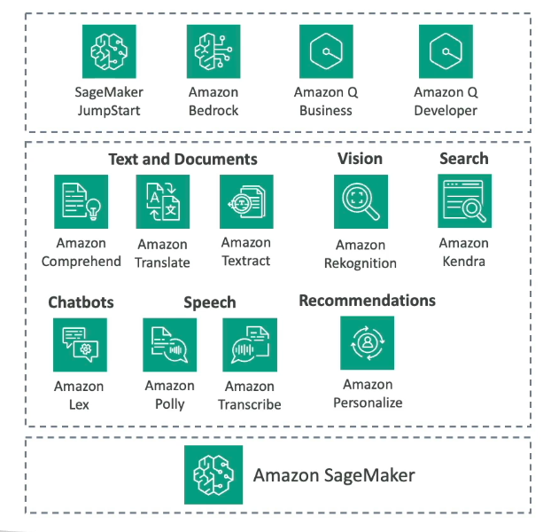
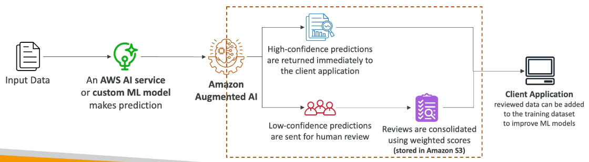

# AWS Managed AI services

## Amazon Comprehend

To understand Natural Language from a text
- fully managed
- serverless
- can identify if positive or not (analyze customer feedback for example)
- Can be custom classified (complains, support, customer requests etc...)

## Part of Amazon Comprehend - Named Entity Recognition (NRE)

Recognise usefull informations from a **text**
A text, a mail -> can identify a name, an address... from a text

## Amazon Translate

Can translate from a language to another.
Texts or list of files...
And of course can take a S3, as source or destination

Of course you can add metrics 

## Amazon Transcribe

Speech to text

`A scribe writes your speech on a paper`

Can auto-remove PII (personal infos)
can work in real time.

Transcribe can be enriched with slang, technical words, acronyms... to understand a domain specific lexic, related to your work for example. 

A little bit like Comprehend, Transcribe can detect toxicity and feelings and apply a censorship. 

## Amazon Polly

Text to speech

`Polly speaks to you politely`

- Generative way : the most expressive
- Long form : more natural
- Neural : more natural and humain like
- Standard : more.... natural.... again.

## Amazon Rekognition

Recognize images.
Can add additional labels.
Can detect inappropriate.

Let's guess a chatbot receiving an image, it can be sent to Amazon rekognition to understand it, and resend it.

## Amazon Lex

Get a chatbox in text or audio 

`AWS Lex is an equivalent of Alexa for AWS.`

## Amazon Personalize

Can me recommandation

`Amazon Personalize is the technology related to amazon.com online shopping website`
- recipes
- products
- ranking items (to help personalization)
- ...

## Amazon Textract

Exact data from documents (pdf, images of document like ID cards...)

## Amazon Kendra

Extract Answers from a question based document (pdf, images of document like ID cards...) and incremental learning based on that.
It's made to have a customer filter.

## Amazon Mechanical Turk

Virtual Workforce as a service
Slavery as a service.
The work is done by humans.

You send a dataset to AWS Mechanical Turk, a task to be done, and a price per action (for example 0.10$ per image to tag 10 millions images).

Integrate with Amazon A2I, SageMaker Ground Thruth...

## Amazon Augmented AI (A2I)

It's a part of Amazon SageMaker.
Human oversight/monitor on predictions made by Machine Learning in production.

It's like a pipeline
1. you indicate an input (for exemple a S3 containing files)
2. Associate a service (for example Amazon rekognition that can define a threshold of "confidence score" based on violence of explicite dangerous stuff)
3. Define a threshold (0 to 100) based on the confidence score from the previous chosen service
----> In a define range -> will trigger a human check
----> Out of a define -> let the file be treated by a next service
----> You can decide to send in any case at least X% of the files
4. Define the instructions for the human to work with
5. Define the kind of people you want the files to be handled
---> inner aws worker (mechanical turk)
---> private (you own team)
---> marketplace (third party team possibly specialized)

## Amazon Comprehend Medical and Transcribe Medical

Comprehend (variables from text extraction) is specialized with medical lexic.
Transcribe (speech to text) can understand medical words.

## Amazon's Hardware for AI !

So remember EC2 == VM by AWS.

Here we are talking about having specific instance type for EC2 adapted to machine learning (creation) or inference (model requesting). 

**AWS Trainium** (material : Trn1) : Machine Learning chip made to perform deep learning.
50% cost reduction when training a model

**AWS Inferencia** (material : Inf1 or Inf2): ML chip made to deliver inference (model requesting) at high performance and low cost.
up to 4* throughput and 70% cost reduction 

"Trn and Inf has the lowest environmental footprint".

All services are serverless or managed until now so no service require an EC2, but it can be still useful to have it.

## Quiz

Transcribe DO NOT recognize the customer intention. Lex DO RECOGNIZE customer's intentions since it's based on comprehend.
Customized user experience => service "AWS Personalize"
Kendra is more about extraction answers from questions, and assimilating them, officially it's a "document search/parse service", a specialized version of Comprehend.
Comprehend to group texts by topics, using *Natural Language*
Translate is about traducing texts from a language to another
Transcribe is about speech to text
Amazon Augmented AI makes possible to enable reviews of ML predictions
DO NOT CONFUSE with Amazon Mechanical Turk which is made to have human people doing simple tasks and being paid by tasks on demand.

