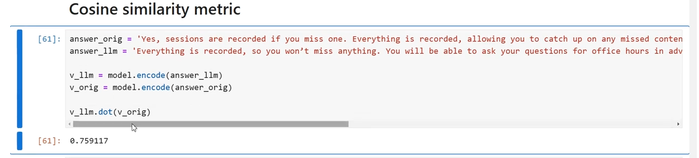
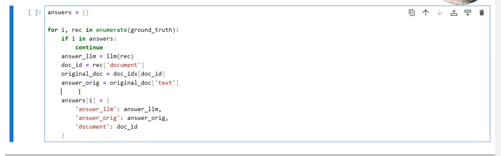
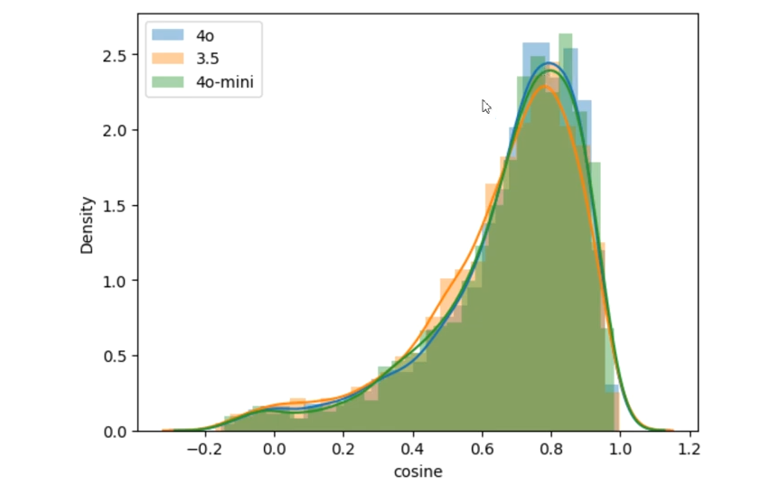
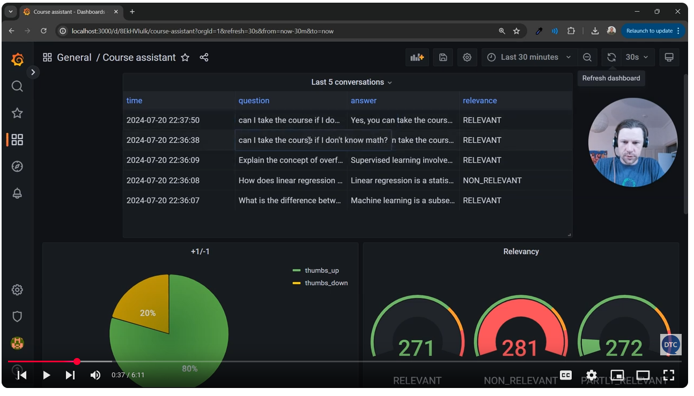
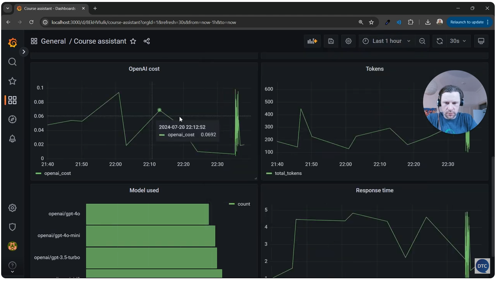

# monitoring

https://github.com/DataTalksClub/llm-zoomcamp/tree/main/04-monitoring

## Quality

- Store user historic exchanges
- Use Grafana to the the exchanges

## Metrics

- Quality of answers (bias and fairness, topic clustering...)
- system metrics (latency, traffic, errors, saturation)
- Cost ( cost of usage os the infrastructure )
- Maths ? (hitrate, MRR Mean Reciprocal Rank, cosine similarity to evaluate the answer ?)

```
https://en.wikipedia.org/wiki/Mean_reciprocal_rank

The mean reciprocal rank is a statistic measure for evaluating any process that produces a list of possible responses to a sample of queries, ordered by probability of correctness.
```

- Ground truth dataset (verified, true data used for training, validating and testing artificial intelligence models)
- How questions to get a final correct answer

`original_question -> answer_llm -> new_question -> adjusted_answer -> ... -> final_adjusted_question -> final_answer`
 -> You do the cosine similarity on the answer to get the best answer.

A cosine similarity is a metric used to measure how two vectors are.
Since questions and answers are vectors, both can be compared to get a cosine similarity.
`cosine(original_question,final_answer)`

A cosine similarity score is between 0 and 1 : O indicated no similarity when 1 indicate a great similarity.
Since similar concept a near to each other in a vector database, a high similarity indicates a near location of two vectors when a low similarity indicates a long distance between two vectors.
The game will be to approach 1 score, an acceptable gap between the score and 1 is subject of debates and is strongly depends of what kind of data you manipulates and what you search to achieve, the more you will go to a perfect response the bigger and more trained is your model, to a point that it could become really specialised.





```
Reminder : for LLMs all data are represented as vectors.
Vectors are a way to represente a sentence as mathematics. 
```

## A little code sample about managing answers

To analyse a whole discussion between an IA and a user/input.

```

import json

answers = []

for record in tqdm(samples):
  answer = llm(prompt, model='gpt-4o-mini')
  answers.append(answer)

json_answers = []

for i, str_answer in enumerate(answers):
  json_answer = json.load(str_answer)
  json_answers.append(json_answer)

df_answers = panda.DataFrame(answers)
df_answers['Relevance'].value_counts()

```

Return something like that 

```
High       120
Medium      45
Low         35
Name: Relevance, dtype: int64
```

 - 120 answers were marked as "High" relevance.
 - 45 answers were marked as "Medium" relevance.
 - 35 answers were marked as "Low" relevance.

A higher count in "High" relevance could indicate that the model is producing more relevant answers.
If "Low" is more frequent, it may suggest that the model is struggling with providing relevant answers.


## Capturing user feeback

 - user adding +1 -1 on answer
 - ??

## Grafana as monitoring



In this capture "Relevant" is got by the prompt template.




